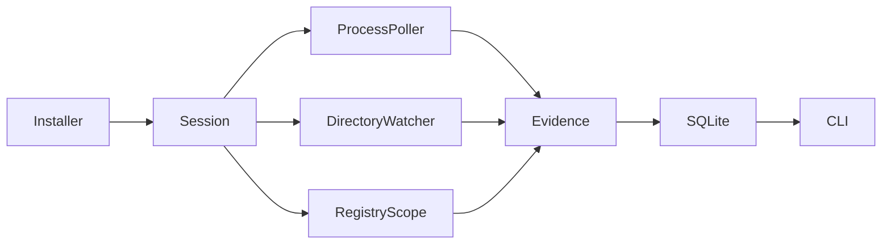

# Contain

**Install anything. Leave nothing behind.**

> Give every Windows app an identity, a boundary, and a clean way out.

Contain currently focuses on observing and attributing application changes. Full filesystem/registry virtualization is a long-term goal and is not part of v0.1. The tagline describes the direction of the project, not a current zero-leftover guarantee.

## Why Contain?

Traditional installers can change files, registry values, startup settings, services, and scheduled tasks across Windows. Their uninstallers often leave data behind. Contain starts with an evidence record: what changed during a specific installation session, which processes can be linked to the installer, and how strong that link is. It does **not** equate a before/after difference with ownership.

## Demo

Requirements: Windows 10/11, [Rust stable](https://rust-lang.org/tools/install/), and Visual Studio C++ build tools. From a PowerShell terminal in the repository:

```powershell
./scripts/demo.ps1
```

The script builds the CLI and a safe test installer, makes a uniquely named directory directly under `%TEMP%`, watches it, launches the installer, checks the captured process tree, file changes, HKCU test values, SQLite readback, `diff`, and `remove --dry-run`, then cleans the fixture. `-KeepArtifacts` retains the fixture and database for inspection. The fixture creates a **simulated** startup artifact within the test directory; it does not register an actual Windows autostart entry.

Run the CLI yourself:

```powershell
cargo build --workspace
$root = Join-Path $env:TEMP 'contain-demo-manual'
New-Item -ItemType Directory -Force $root | Out-Null
$key = 'Software\Contain\Demo\contain-demo-manual'
./target/debug/contain.exe install ./target/debug/contain-test-installer.exe --name TestFixture --watch $root --registry-key $key -- --root $root
./target/debug/contain.exe list
./target/debug/contain.exe inspect TestFixture
./target/debug/contain.exe diff TestFixture
./target/debug/contain.exe remove TestFixture --dry-run
./target/debug/contain-test-installer.exe --root $root --cleanup
```

For a real installer:

```powershell
contain install .\SomeAppSetup.exe --watch "$env:LOCALAPPDATA\SomeApp"
```

The watch directory must already exist. Repeat `--watch` for more directories. If omitted, Contain watches the directory containing the installer, which is usually insufficient for a real installation. Use `--registry-key Software\Vendor\App` to compare values in one HKCU key. Pass installer arguments after `--`.

## Features

- Starts an installer and stores an installation session with time, exit code, and watch scopes.
- Polls Windows processes and records a descendant only when a sampled parent chain is still verifiable. The launched installer is `Certain`; observed descendants are `High`.
- Watches selected directories for real filesystem notifications and compares BLAKE3 file state before and after. Creates, modifications, and deletions survive in a structured SQLite event record.
- Optionally compares values in one explicitly selected `HKCU\Software` key.
- Shows `list`, `inspect`, `diff`, `history`, and `doctor` output. `inspect --json` exports the same evidence for scripts.
- `remove <app> --dry-run` reviews still present tracked files and preserves user data. It never removes anything.
- Saves data locally by default at `%LOCALAPPDATA%\Contain\contain.db`; `--db` can select another path.

## How it works



Directory notifications and registry comparisons do **not** include the writing process ID in this implementation. Those changes are displayed with `Unknown` application attribution and an explicit reason, even when they occur during a known installer session. See [architecture and evidence model](docs/architecture.md).

## Architecture

The workspace has a `contain-core` library for session capture, monitors, evidence models, SQLite, and cleanup planning; a `contain` CLI; and a small fixture installer. SQLite has separate application, session, process, event, file-change, and registry-change tables. BLAKE3 provides fast file content identity and drift detection; it is not used as an authentication mechanism.

## Safety model

No privilege escalation, Defender change, service installation, or kernel driver is used. The scanner does not follow symlinks. The cleanup planner checks current file type and hash, and treats changed files as `UNKNOWN`. User data is `USER_DATA`; cache paths are `REVIEW`; other paths are `UNKNOWN`. There is currently no `SAFE` decision and no deletion executor. Running `remove` without `--dry-run` returns an error.

The demo cleanup is limited to a marked, specially named direct child of the system temp directory and its matching HKCU test key. Do not run real installers merely to evaluate Contain on a machine you cannot restore; Contain itself does not undo the installer.

## Privacy

**Your computer history stays on your computer.** Contain has no account, telemetry, analytics, or upload code. The local database and optional JSON manifests can contain personal paths and registry values; review and redact them before sharing.

## Current limitations

- No ETW backend or process keyed file/registry events. File and registry **ownership remains unknown**.
- Process sampling can miss fast or detached children. PID reuse is guarded by sampled start times but cannot recover missed ancestry.
- Only selected directories and one optional HKCU key are observed. Registry subkeys, services, scheduled tasks, real startup entries, shell integrations, and the rest of the system are not inventoried.
- Some file notifications may be lost; surviving state changes inside watch roots can still be found by before/after comparison. Files inaccessible to the current user and reparse points are excluded. Entirely transient files are not retained in the manifest.
- No official uninstaller discovery, automatic cleanup, rollback, virtualization, driver, or GUI.
- No claim of zero leftovers or compatibility with every Windows installer.

## Roadmap

- **v0.1 Observe:** strengthen process and scoped file/registry observation, tests, and manifest export.
- **v0.2 Explain:** ETW-backed process keyed evidence where feasible, service/task/startup inventories, timeline, and richer attribution.
- **v0.3 Clean:** official uninstaller integration, post-uninstall rescan, reviewed cleanup plans, explicit safe executor.
- **v0.4 Contain:** investigate filesystem and registry redirection and temporary installations.
- **Future:** stronger isolation and an optional driver only if user-mode evidence shows a justified gap.

No dates or completeness guarantees are implied.

## Development

```powershell
cargo fmt --all -- --check
cargo clippy --workspace --all-targets -- -D warnings
cargo test --workspace
cargo build --workspace
./scripts/demo.ps1
```

CI runs these on a Windows runner without requesting elevation. See [CONTRIBUTING.md](CONTRIBUTING.md).

## Contributing

Please file a scoped issue or pull request and describe what evidence supports any new attribution claim. Security reports should follow [SECURITY.md](SECURITY.md). Contributors are expected to follow the [code of conduct](CODE_OF_CONDUCT.md).

## License

Apache-2.0. See [LICENSE](LICENSE).
