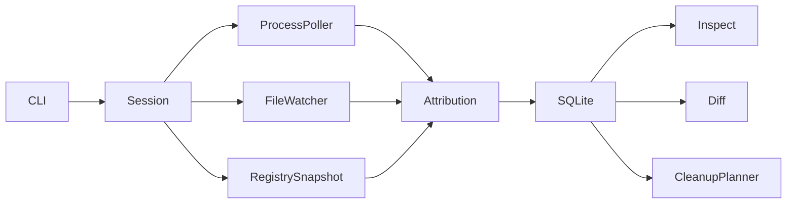

# Architecture and evidence model

Contain v0.1 is a bounded Windows observation tool. A session starts an installer, polls the process table, watches explicitly selected directories with Windows file notifications through `notify`, and compares file state before and after the session. It can also compare values in an explicitly selected HKCU registry key. SQLite stores applications, sessions, observed processes, generic events, and typed file and registry changes.

## Attribution

The installer process is `Certain`: Contain launched it and has its PID. A descendant is `High` only when a sampled parent chain connects it to the launched process. Polling may miss short lived or detached children. PID reuse can make a parent ID ambiguous, so a process without a sampled chain is not attached.

The filesystem watcher reports paths and operations, not the writing PID. A matching before/after change with a watcher event is a **real observed change**, but its application ownership remains `Unknown`. A change visible only in the snapshots is also `Unknown`, with a different reason. Scoped registry snapshots similarly cannot prove the writer. This distinction is stored per event and shown by `inspect` and `diff`.

Watching is scoped. Without `--watch`, Contain watches the installer directory; use `--watch` for each expected installation location. It does not cover Program Files, AppData, services, scheduled tasks, or all registry hives by default. No ETW consumer or kernel driver is present. File events from very short writes may be missed by the watcher; final state comparison still detects surviving changes within watched roots. A file present before and absent after is recorded as deleted. A file created and removed entirely during the session is not retained in the current manifest. Unreadable paths and reparse points are excluded from the diff rather than reported as deletions.

## Safety

`remove --dry-run` only reads the database and current filesystem. The planner marks user data as `USER_DATA`, caches as `REVIEW`, and everything else as `UNKNOWN`. It never deletes. The current version has no destructive `remove` path and does not run uninstallers. A file changed since capture is flagged as changed and cannot be treated as the same artifact. Symlinks and junctions are not traversed by the scanner. No elevated privileges are requested.

## Hashing and storage

BLAKE3 is used for fast content identity and later drift detection, not for security authentication. File metadata and hashes are captured for regular files in watched roots. Database writes use transactions and foreign keys. The database lives at `%LOCALAPPDATA%\Contain\contain.db` unless `--db` is supplied. All collected data stays local.

## Next capabilities

An ETW backend could supply process keyed file and registry events where permissions allow. Service/task/startup inventories, official uninstaller discovery, and an explicitly confirmed cleanup executor are future work. Those capabilities must preserve the evidence and safety boundaries above.
