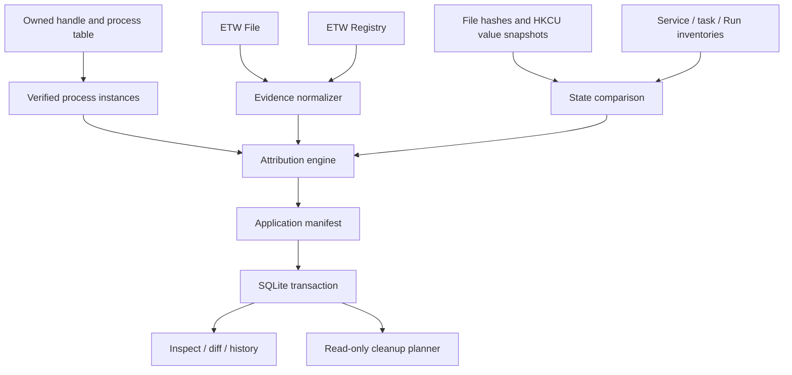

# Architecture and evidence model

Contain v0.2 uses deterministic evidence to answer who caused an observed change. `contain-core` separates sources, normalization, attribution, persistence, and cleanup planning. `contain-cli` renders text or a versioned JSON envelope; the fixture is a separate executable.

## Three kinds of truth

1. **Event truth:** an ETW record reported an operation at a timestamp. File request events do not supply success; registry records can supply NTSTATUS. A create/open event is not evidence of a newly created file.
2. **Attribution truth:** the event's writer process instance belongs to the installation session. This requires a PID, precise creation time, executable identity and verified ancestry. It says nothing about exclusive ownership of a shared resource.
3. **State truth:** hashes or configuration differ between snapshots. This does not establish a writer or exact mutation time. A transient operation can exist in the stream without a final-state difference.

Composition retains these facts separately. `state_validated` means a related state difference was observed, not that an individual request succeeded. Mixed/unresolved writers or capture loss keep final state Unknown. Raw source events can remain High when their own instance evidence is valid despite gaps elsewhere.

## Source boundary

`monitor::EventSource` exposes `drain` and `stop`; construction configures scopes and starts the source. `windows::etw::EtwSource` owns a UUID-named user trace, consumer thread and bounded channel. Provider decoding does not decide application ownership. Future sources can emit the same `SystemEvent`/`AttributionEvidence` without rewriting policy.

`windows::native` wraps process/thread/token queries, device-name mapping and trace stop/statistics. Borrowed process handles carry Rust lifetimes; owned handles are closed. Each unsafe block explains API buffer/handle invariants. Sources never elevate.

## Process identity and rules

Process records are keyed by `(PID, creation FILETIME)`, with executable path, parent PID/creation time, first/last observation and an optional known exit time. The root comes from the owned child handle. Polling attaches a descendant only while the parent instance is live and matches its saved creation time, and the child was created later. Previously saved PIDs alone cannot attach a child. A missed parent remains a gap.

| Confidence | Current rule |
| --- | --- |
| Certain | Contain directly launched the installer; root start/exit observations use its owned handle |
| High | Verified descendant process, or ETW writer whose PID, birth and image match a Certain/High process within its known lifetime |
| Medium | Inventory target executable exactly matches a verified process image; entry writer remains unknown |
| Low | Reserved; no weak-signal heuristic currently emits it |
| Unknown | Snapshot-only, unrelated writer, missed ancestry, unresolved identity, PID reuse, mixed writers or insufficient capture completeness |

Certain never labels file/registry ownership. File ETW uses **IssuingThreadId** rather than a kernel worker's header PID: a live thread creation time must precede the event; its live owning process creation time must also precede it. Dead/unqueryable threads are Unknown. Registry uses the event header PID and a live process identity query. Requested ETW ProcessStartKey metadata is not yet used as an identity substitute.

Evidence retains source, writer PID/birth/image, parent and installer ancestor, attributed session UUID and an enum rule, plus a human explanation. Snapshot records do not acquire a writer merely because they carry a matching path.

## Capture lifecycle

1. Validate file/HKCU scopes, collect file/registry and read-only inventories.
2. Start notifications and attempt ETW. A failure yields an explicit degraded report.
3. Spawn installer, obtain its handle identity; poll process ancestry and drain events approximately every 30 ms.
4. Wait for owned root exit, observe the configured settle window, stop the trace producer and drain its consumer, collect final snapshots.
5. Attribute events, compose state evidence, append explicitly labelled snapshot/inventory observations to the timeline, save in one SQLite transaction.

Snapshot collection is not atomic with ETW start/stop. Changes outside trace coverage remain potentially unobserved and snapshots alone stay Unknown. Contain is scoped observation, not a transaction or sandbox. The default settle window is 500 ms, not a promise to capture all later updater activity.

## Windows inventories

Services use read-only `Win32_Service` CIM via the system Windows PowerShell executable. Tasks use Task Scheduler `Schedule.Service` COM, including hidden tasks, executable/actions/arguments and trigger XML. Startup uses `winreg` read access to HKCU/HKLM Run in 32/64-bit views. Scripts are fixed source files with no user interpolation or profile loading. Powershell workers have a 20 s deadline and bounded output; unavailable is distinct from an empty inventory.

Inventories store before/after changed entries. A target matching the observed executable can be Medium; a shared `svchost.exe`, multiple task actions, path similarity, environment-variable path or new entry by timing is never silently promoted to High. No service, task or startup writes occur during ordinary capture.

## Capacity and storage

- ETW trace buffers: 64 KiB each, minimum 8, maximum 64; kernel allocation may be adjusted by Windows.
- Application channel: 8,192 events; file-object map: 16,384 entries; retained source events: 100,000 per capture. Capacity exhaustion increments `dropped_events`.
- Directory notification path set: 100,000 entries, with errors/rescan/capacity warnings. Notifications do not identify writers.
- No per-event SQLite writes. Observations and typed process instances are inserted inside the final session transaction. State snapshots still scale with the number and size of scoped files.
- `user_version=2` migration preserves v0.1 data. Legacy ancestry lacks exact lifetimes and is shown Unknown; original database rows remain intact. Newer databases are rejected before schema mutation. See [JSON/storage contract](json-contract.md).

Structured diagnostics use `tracing` JSON on stderr. Default level is warn; `RUST_LOG=contain_core=info` adds session counts. Debug tracing can include requested registry paths. Local databases/manifests are sensitive; there is no telemetry.

## Cleanup boundary

The planner reads current file type and content identity. Reparse/missing/drifted files are excluded or Unknown. User data is preserved regardless of confidence; only unchanged High-attributed cache paths can be Review. No deletion executor, SAFE decision, rollback, driver or automatic UAC exists. The narrowly scoped fixture has its own marker-checked cleanup and is not a general cleanup implementation.
